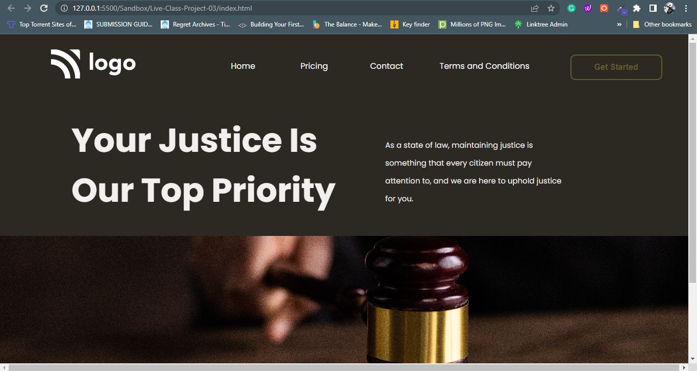

# Third Website in pure HTML and CSS
---
### Description 
This is a landing page designed for a law firm in pure HTML and CSS. The overall time took to complete this project was around `2-3 hours`. The major effort in this project was layering the image in the background above the navbar and other menu items using the `Z-index`. 
---

<!-- ABOUT THE PROJECT -->

## About The Project

Here's a Screen-Shot of my first project and I learnt Most of my usefull Future of `HTML` and `CSS`.
 
 

<!-- PROJECT LOGO -->
 

  

<h3 align="center">Project 01</h3>

  
   
    <a href="https://harshalvrm-project03.netlify.app">View Live Demo</a>
  

## Built With

**Using Technologies**

1. `HTML`
2. `CSS`
3. `MarkDown`

> The challenge of this project was to design the page as it is from scratch with pure CSS without using any frameworks.

 

## Live Project

This project is presently deployed in **`Netlify Service`**.

[Live Project URL](harshalvrm-project03.netlify.app)
 

<!-- LEARNT -->
 

## Learnt
In This project I learnt the following properties of HTML and CSS.
- Z-index properties.
- CSS Grid Layout
- CSS clip Property

 
<!-- CONTACT -->

## Contact

- **Name 👨‍💻:** [Harshal Verma](https://github.com/harshalvrm)
- **Email 📧:** [harshalvrm3@gmail.com](mailto:harshalvrm3@gmail.com)
- **Blog 📝:** [Hashnode blog](https://xadai.hashnode.dev/)

[Project 3 Link](https://harshalvrm-project03.netlify.app) 

